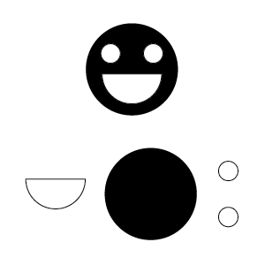

### Goals

In this lesson we'll talk about:

* What Gestalt Psychology is
* The Gestalt Principals

### What is Gestalt Psychology

Gestalt Psychology is a concept that is used to describe how we perceive the world around us as complete units an patterns rather than a series of unrelated parts. "Gestalt" means "shape" or "form", which is fitting since the principals it outlines describe the ways in which humans are hard-wired to apply structure and meaning to clearly and quickly understand their surroundings. Developed in the early 20th century by Kurt Koffka, Max Wertheimer and Wolfgang Köhler, Gestalt was their approach to explaining that people's perceptions are a primal function that allows them to see unrelated objects as a whole, or global, construction within an environment.

### The Whole is Greater than the Sum of its Parts

Gestalt suggests that the whole is, in fact, different (and greater) that the individual parts that make it up. Based on this belief, a set of laws were written to explain out perceptual organization and how people group smaller objects together to form larger, more significant objects. While it is important to note that these laws do not result in good design by themselves, they are extremely useful to leverage when identifying and solving problems we face when designing highly usable and clear interfaces.

#### Law of Figure-Ground

A figure shall be perceived as separate from it's background.

Figure is _positive space_ (or the object itself, like a tree) and Ground is the _negative space_ (the space behind the object, like the sky).

_Rubin's Vase is an example of ambiguous figure/ground_

#### Law of Simplicity

Items will be organized into as "good" (symmetrical, simple, smooth, and regular) as possible.

_This appears to be two overlapping circles, not a combination of two crescents_

#### Law of Proximity

Elements next to each other tend to be grouped together.

_Even though this is made up of unrelated elements, we see a column on the left, a square to the upper right, and a short row on the lower right_

#### Law of Continuation or Continuity

Objects aligned on a path are viewed as moving in an implied direction. We continue to follow contours when the elements have established a pattern of direction.

_The eye follows the full path implied by each line to see a complete circle_

#### Law of Closure

Contours and gaps in a figure will be seen as completed contours

_There are no triangles or circles in this visual, but we are able to fill the missing space to complete these familiar shapes_

###### *Image Credit: [Word Wildlife Fund](http://wwf.panda.org/)*

#### Law of Similarity

Elements that look similar will be perceived as part of the same form

_Despite the similar scale and distribution of shapes, we see columns of squares and circles_

<!-- ***

> #### *"Sometimes I get emotional over fonts"* - Kanye West

***

## Homework Reading

* [Accessibility: Improving The UX For Color-Blind Users](https://www.smashingmagazine.com/2016/06/improving-ux-for-color-blind-users/)

## Resources

* [HTML Color Picker](http://htmlcolorcodes.com/color-picker/) -->
