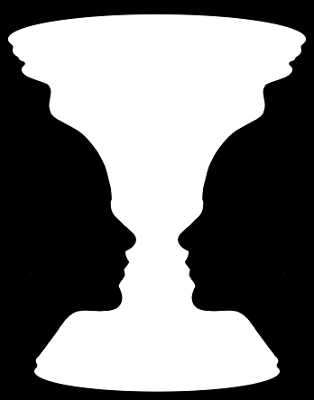
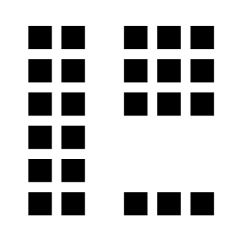
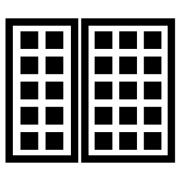

### Goals

In this lesson we'll talk about:

* What Gestalt Psychology is
* The Gestalt Principals

### What is Gestalt Psychology

Gestalt Psychology is a concept used to describe how we perceive the world around us as complete units and patterns rather than a series of unrelated parts. "Gestalt" means "shape" or "form", which is fitting as these principals describe the ways in which humans are hard-wired to see patterns and apply structures to quickly understand their surroundings. Developed in the early 20th century by Kurt Koffka, Max Wertheimer, and Wolfgang Köhler, Gestalt was their approach to explaining how people's perceptions are a primal function that allows them to see unrelated objects as a whole, or global, construction within an environment.

### The Whole is Greater than the Sum of its Parts

Gestalt suggests that the whole is, in fact, different (and greater) that the individual parts that make it up. Based on this belief, a set of "laws" were written to explain our perceptual organization and how smaller objects group together to form larger, more significant objects. While it is important to note that these laws do not result in good design by themselves, they are extremely useful to leverage when identifying and solving the problems we face when designing highly usable and clear interfaces for users.

### Gestalt Principals

The Gestalt psychologists developed these laws, or principals, to explain perceptual organization, the way smaller objects are organized and grouped to form larger, complete objects. These principals can be thought of as mental shortcuts for visual problem solving.

#### Law of Figure-Ground

A figure shall be perceived as separate from it's background.

Figure is _positive space_ (or the object itself, like a tree) and Ground is the _negative space_ (the space behind the object, like the sky).

_Rubin's Vase is an example of ambiguous figure/ground_

#### Law of Simplicity

Items will be organized as "good" (symmetrical, simple, smooth, and regular) as possible.

_This appears to be two overlapping circles, not a combination of two crescents_

#### Law of Proximity

Elements next to each other tend to be grouped together.

_Even though this is made up of unrelated elements, we see a column on the left, a square to the upper right, and a short row on the lower right_

#### Law of Enclosure

Related items grouped together with a visual element will be perceived as one complete element.

#### Law of Continuation or Continuity

Objects aligned on a path are viewed as moving in an implied direction. We continue to follow contours when the elements have established a pattern of direction.

_The eye follows the full path implied by each line to see a complete circle_

#### Law of Closure

Contours and gaps in a figure will be seen as completed contours

_There are no triangles or circles in this visual, but we are able to fill the missing space to complete these familiar shapes_

###### *Image Credit: [Word Wildlife Fund](http://wwf.panda.org/)*

#### Law of Similarity

Elements that look similar will be perceived as part of the same form

_Despite the similar scale and distribution of shapes, we see columns of squares and circles_

### Gestalt Principals in Digital Products

Let's take a look at some examples of Gestalt in action.

#### Law of Similarity

By using consistent size, spacing, and alignment, we see this group of icons as a complete set of options to choose from rather than unrelated elements.

###### *Image Credit: [Carolann Bonner - Thoughtbot](https://robots.thoughtbot.com/gestalt-principles)*

#### Law of Enclosure

This examples shows several levels of enclosure, which all help to clarify and streamline how we read and understand this content.

###### *Image Credit: [Carolann Bonner - Thoughtbot](https://robots.thoughtbot.com/gestalt-principles)*

#### Law of Continuation or Continuity

The dotted line that shows us the walking route to a destination is understood to be a continuous line leading us somewhere, rather than a simple assortment of circles.

Another example of this is the status bar of a media player. The accent color is perceived to represent how far the track has progressed, and the neutral color is seen as the amount of time left on the track.

#### Law of Proximity

We can see that the avatar, user name, and display name are grouped closely together. This helps us read this information as a group of related and connected objects. It also separates the user details from the secondary information that described number of tweets and followers.

## Your Turn

In small groups, find the following:

* 2-3 examples of these Gestalt Principals being used in digital products or websites that you use regularly. Which laws are being applied? How do these principals make understanding the information easier?
* 1-2 examples where using Gestalt Principals would add clarity and legibility. Which law would you use? How would it make the content more organized and understandable?
